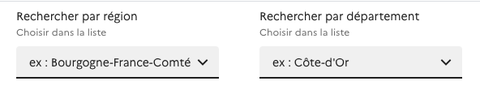

# How to integrate widgets

Widgets need two files in order to work : 

[app.css](https://widgets.barometre-resultats.data.gouv.fr/css/app.css)

[app.js](https://widgets.barometre-resultats.data.gouv.fr/js/app.js)

Add those two files to your html head.

The CSS file of the DSE is expected to be present on the hosting page.

Widgets can now be called directly into the page as custom html elements.

## Box with number


```
<data-box ovqid=""></data-box>
```

This widget expect one parameter ovqid. The value should be a string corresponding to an id of an OVQ from the projet. Eg :  

```
<data-box ovqid="OVQ-PVL"></data-box>
```

## Region and departement list



```
<geo-lists></geo-lists>
```

This widget expect no parameter. The value selected in one of the list will apply to every other widgets in the page.