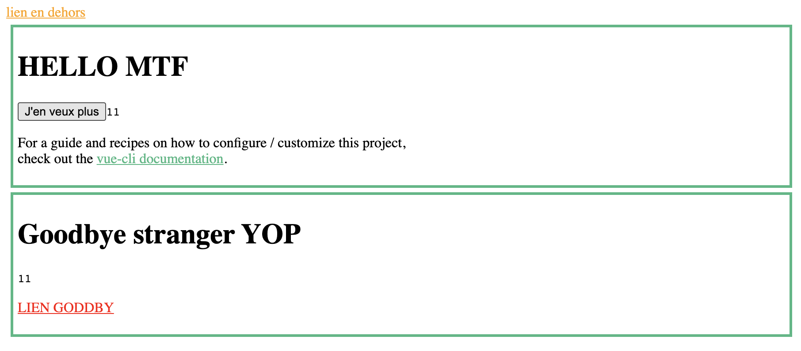

# widget-demo

This demonstrates a very dummy widget-based application using Vuejs.

## Concepts

This uses [vue-custom-element](https://github.com/karol-f/vue-custom-element) to build, well, custom element that can be used as widgets.

Two components are defined: `HelloWorld` and `GoodBye`, and they're exposed as `<hello-world>` and `<good-bye>` custom elements.

`index.html` includes those components. It mocks an embedding web page that can use whatever style or javascript it wants.

### Features

- components share a store, and thus a state — demonstrated by the counter incremented in `hello` and shown in `goodbye`
- components can communicate to the parent page — demonstrated by an event sent from `hello` (`hello:increment`) and received by some vanilla JS on `index.html`
- components have scoped styles — demonstrated by the link colors (orange in embedding page, green and red in components)
- components have styles shared by all components (:warning: and probably the embedding page), demonstrated by the border around components on class `.hello`
- embedding page can dynamically update component props and they're reactive — demonstrated by `index.html:setTimeout` -> `<good-bye>.msg`



### Todo

- do we really need `vue-custom-element` vs regular Vue apps mounted to specific DOM elements in the parent page?
- static assets handling (fonts, img...)
- separate builds for each component, without pulling all the dependencies of all the components (`--target lib`), which impact on the store?
- communication from parent window to components (event based probably)
- url routing
- disable chunked build when the app will grow large

## Resources

- https://itnext.io/vuidget-how-to-create-an-embeddable-vue-js-widget-with-vue-custom-element-674bdcb96b97
- [GitHub - karol-f/vue-custom-element: Vue Custom Element - Web Components&#39; Custom Elements for Vue.js](https://github.com/karol-f/vue-custom-element)
- https://innovation.enova.com/building-an-embeddable-micro-frontend-with-vue-js/

## Project setup
```
npm install
```

### Compiles and hot-reloads for development
```
npm run serve
```

### Compiles and minifies for production
```
npm run build
```

### Lints and fixes files
```
npm run lint
```

### Customize configuration
See [Configuration Reference](https://cli.vuejs.org/config/).
