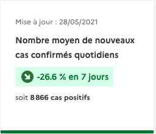
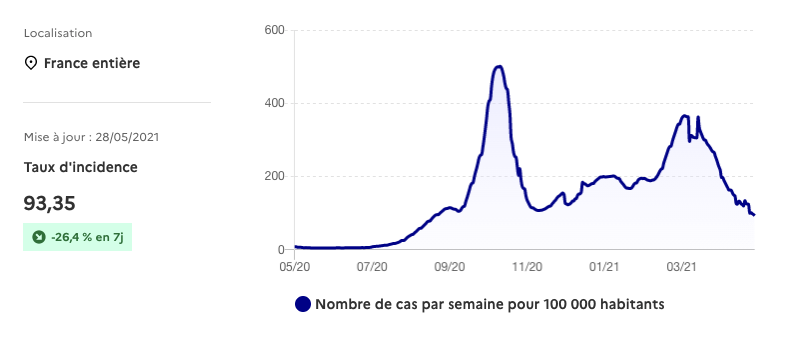
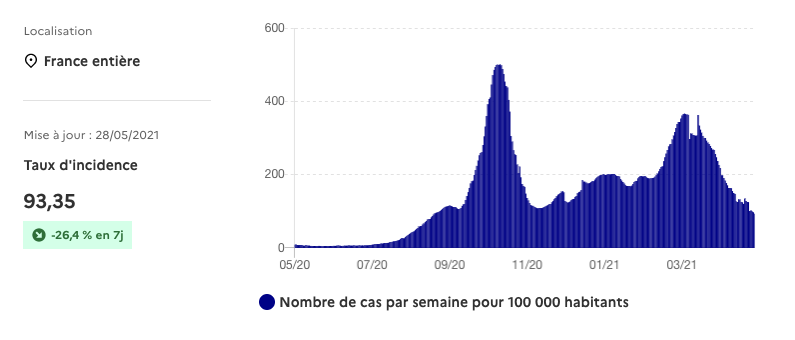
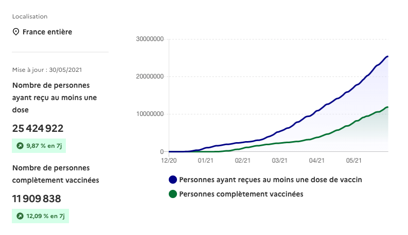
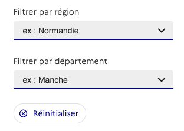

# How to integrate widgets

Widgets need two files in order to work : [app.css](https://widgets.dashboard.covid19.data.gouv.fr/css/app.css) and [app.js](https://widgets.dashboard.covid19.data.gouv.fr/js/app.js)
Add those two files to your html head.

The CSS file of the [DSE](https://systeme-de-design.gouv.fr/) is expected to be present on the hosting page.

Widgets can now be called directly into the page as custom html elements.
Widgets takes a least one parameter *indicateur*. The value should be a string corresponding to the name of a JSON file available in [this repository](https://data.widgets.dashboard.covid19.data.gouv.fr/).

## Box with number



```
<data-box indicateur="cas_positifs"></data-box>
```

Require one parameter *indicateur*

## Line chart



```
<line-chart indicateur="cas_positifs"></line-chart>
```

Require one parameter *indicateur*

## Bar chart



```
<bar-chart indicateur="cas_positifs"></bar-chart>
```

Require one parameter *indicateur*

## Multiline chart



```
<bar-chart indicateur="cas_positifs"></bar-chart>
```

Require 2 parameters *indicateur1* and *indicateur2*

## Choropleth map


```
<map-chart indicateur="cas_positifs"></map-chart>
```

Require 1 parameters *indicateur*

## Localisation input list



```
<geo-list></geo-list>
```

Require no parameter. If included, the change of localisation will trigger the update of every widgets on the same page.

## Resources

- https://itnext.io/vuidget-how-to-create-an-embeddable-vue-js-widget-with-vue-custom-element-674bdcb96b97
- [GitHub - karol-f/vue-custom-element: Vue Custom Element - Web Components&#39; Custom Elements for Vue.js](https://github.com/karol-f/vue-custom-element)
- https://innovation.enova.com/building-an-embeddable-micro-frontend-with-vue-js/

## Project setup
```
npm install
```

### Compiles and hot-reloads for development
```
npm run serve
```

### Compiles and minifies for production
```
npm run build
```

### Lints and fixes files
```
npm run lint
```

### Customize configuration
See [Configuration Reference](https://cli.vuejs.org/config/).

### Notes

Webpack should be install with npm install webpack@^4.0.0 --save-dev
